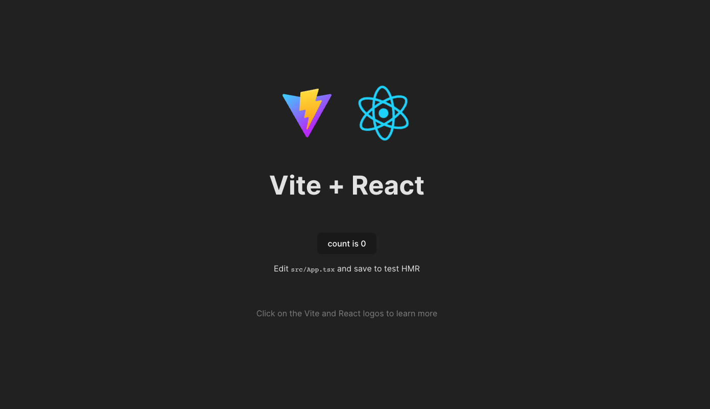

<h1 align="center">
  Vite React Template
</h1>

<p align="center">
  <a href="https://github.com/SafdarJamal/vite-template-react/releases">
    
  </a>
  <a href="https://github.com/SafdarJamal/vite-template-react/blob/main/LICENSE">
    
  </a>
</p>

<p align="center">
    A <a href="https://vitejs.dev">Vite</a> + <a href="https://reactjs.org">React</a> starter template.
</p>


<p>&nbsp;</p>

## Folder Structure

No configuration or complicated folder structures, just the files you need to build your app:

```
vite-react-template
├── node_modules
├── public
│   ├── vite.svg
│   └── robots.txt
└── src
    ├── App.css
    ├── App.tsx
    ├── index.css
    ├── index.tsx
    └── assests
        └── react.svg
├── .gitignore
├── index.html
├── package.json
├── README.md
├── tsconfig.json
├── tsconfig.node.json
├── vite.config.js
```

## Development

To get a local copy of the code, clone it using git:

```
git clone https://github.com/Milan-960/vite-react-template.git
```

```
cd vite-react-template
```

Make it your own:

```
rm -rf .git && git init && npm init
git add .
git commit -m "Initial commit"
```

Install dependencies:

```
npm install
```

Now, you can start a local web server by running:

```
npm start or npm run dev
```

And then open http://localhost:3000 to view it in the browser.

#### Available Scripts

In this project, you can run the following scripts:

| Script        | Description                                         |
| ------------- | --------------------------------------------------- |
| npm run dev   | Runs the app in the development mode.               |
| npm run build | Builds the app for production to the `dist` folder. |
| npm run serve | Serves the production build from the `dist` folder. |

## Credits

Vite Template React is built and maintained by [Milan Sachani](https://milansachani.dev).

## License

This project is licensed under the terms of the [MIT license](https://github.com/Milan-960/vite-react-template/blob/master/LICENSE.md).
